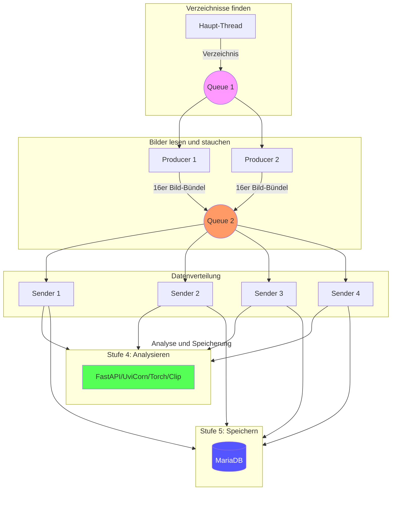
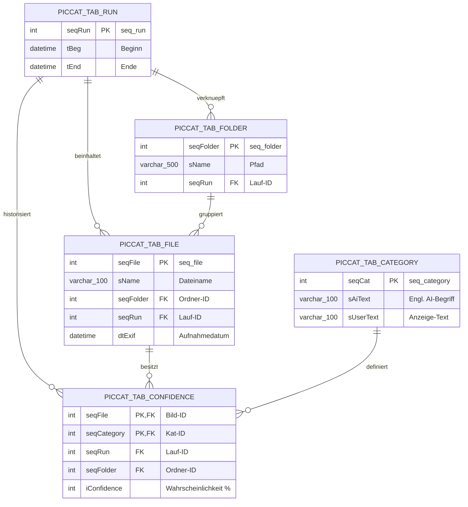

# piccat – Bildanalyse an Hand von Kategorien mit KI (torch/clip) 
Ziel ist, an Hand fest definierter Kategorien Bilder in einem großen Datenbestand zu finden und in einem Bildbetrachter anzuzeigen.

## Danksagungen
Groß Teile der Code-Architektur, der Client-Server-Schnittstelle, Performance-Optimierungen, Fehlerbehandlung und der Bildbetrachter wurden mit der Hilfe von Google Gemini entwickelt. 

## Getestet mit
- Lenovo E570 mit I7-7500 / Windows 10 Prof / MariaDB / tkinter viewer
- Asus mit Ryzen r7 7800x3d und rtx5060 ti / Windows 11 Prof / torch + clip
- Lenovo <--> fastapi <--> Asus
- ca. 90000 Dateien,  182.977 Konfidenzsätze

## Evolution
**Lokale Analyse:**
- [createdb.sql](https://github.com/grasmax/piccat/blob/main/createdb.sql) ... Datenbank-Schema für Kategorien, Dateien und Analyse-Ergebnisse, Schema-Bild s.u,
- [piccat_csv.py](https://github.com/grasmax/piccat/blob/main/piccat_csv.py) ... lokale Analyse, Ergebnis in CSV-Datei
- [piccat_db.py](https://github.com/grasmax/piccat/blob/main/piccat_db.py) ... lokale Analyse, Ergebnis in MariaDB, **Dauer 2,4 Sekunden pro Bild: 60 Stunden**
  
**Analyse auf einem Server:**
- [piccat_server.py](https://github.com/grasmax/piccat/blob/main/piccat_server.py) ... Analyse in Server ausgelagert, 1 Bild pro Serverruf
- [piccat_client.py](https://github.com/grasmax/piccat/blob/main/piccat_client.py) ... Dateiarbeit, Server calls und Speicherung der Ergebnisse in MariaDb, **Dauer 5,5 Stunden**
  
**Optimierte Analyse mit 2 Warteschlangen und 6 Programmfäden im Client und vier Analyseprozessen im Server:**
- [piccat_client_x2x4x16.py](https://github.com/grasmax/piccat/blob/main/piccat_client_x2x4x16.py) ... Client: Hauptthread und 6 Helfer-Threads, 16 Bilder pro Serverruf
- [piccat_server_x16.py](https://github.com/grasmax/piccat/blob/main/piccat_server_x16.py) ... Server: 4 Analyse-Prozesse, **Dauer 1,5 Stunden**
  
- [piccat_viewer_tki.py](https://github.com/grasmax/piccat/blob/main/piccat_viewer_tki.py) ... Anzeige der Ergebnisse

## Client-Struktur

## Beschreibung
Effiziente Bildklassifizierung mit Lastverteilung zwischen I7-7500-Worker und Ryzen r7800x3d-Brain über eine leichtgewichtige FastAPI-Schnittstelle.
Architektur
I7-Worker (Client): Übernimmt das Laden, Rotieren und Skalieren (Resizing auf 224x224) der Bilder, um die Netzlast zu minimieren.
Ryzen-Brain (Server): CLIP-basiertes Modell, das hochperformant Bild-Features berechnet und Ähnlichkeiten zu Kategorien bestimmt.
API-Endpunkte (Ryzen-Brain)
1. Initialisierung
POST /init_brain
Zweck: Übermittelt die Liste der Kategorien und initialisiert die Text-Features im RAM.
Payload: json=cat_list
Antwort: {'status': 'success', 'count': X}
2. Analyse
POST /analyze
Zweck: Nimmt ein vorverarbeitetes Bild entgegen und liefert die Top-Klassifizierungen.
Input:
image: Multipart-File (JPEG, 224x224 px)
seqFile: Integer (ID zur Zuordnung des Bildes)
Output:
json
{
  "s": 12,                  // Sequenznummer
  "c": [18, 27, 38, 24, 43], // Kategorie-IDs
  "p": [48, 14, 12, 4, 4]    // Wahrscheinlichkeiten in %
}

## Workflow (I7-Worker)
Load & Prep: Bild via Pillow laden, bei Bedarf rotieren und auf 224x224 skalieren (LANCZOS-Filter).
Buffering: Bild binär in io.BytesIO zwischenspeichern (vermeidet Festplattenzugriffe).
Transmission: Versand via requests.post mit files und data (für die Sequenz-ID).

## Vorteile dieser Lösung
Kein Overhead: Verzicht auf Apache/Django sorgt für extrem geringe Latenz.
Optimierte Last: Die CPU-intensive Bildvorbereitung findet auf dem Worker statt, die GPU/VPU-intensive Inferenz auf dem Brain.
RAM-basiert: Bildübertragung erfolgt direkt aus dem Speicher des Workers in den Speicher des Brains.
Damit ist der Meilenstein sauber festgehalten.
Soll ich dir noch ein kurzes Shell-Skript oder einen One-Liner dazugeben, mit dem du den Server auf dem Ryzen beim Systemstart automatisch in einem screen- oder tmux-Fenster starten kannst?
KI-Antworten können Fehler enthalten. Weitere Informationen

## Voraussetzungen
### Client-Server-Schnittstelle
git clone https://github.com && cd piccat && python3 -m venv venv && source venv/bin/activate && pip install --upgrade pip && pip install pillow requests fastapi uvicorn python-multipart torch torchvision clip-by-openai

## Datenbank-Schema

